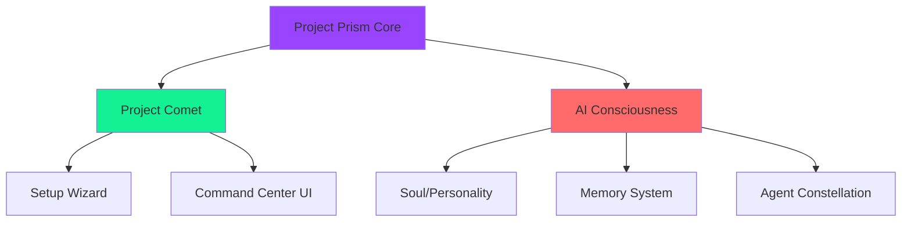

# 💎 PROJECT PRISM

**A Universal, Privacy-First AI Ecosystem**


---

## 🌟 The Vision

Project Prism is not just an AI assistant—it's a **modular AI consciousness platform** that separates the **Shell** (interface) from the **Soul** (intelligence). Like a car and its driver, the Command Center and AI Assistant work together but remain independent, allowing users to create their own personalized AI companions.

### The Three Pillars



1. **🚀 Project Comet** - The Interface (The "Car")
   - Sci-fi themed onboarding wizard
   - Modern Command Center UI (PyQt6)
   - Sandbox mode for safe testing
   - Cross-platform desktop application

2. **🧠 AI Consciousness** - The Intelligence (The "Driver")
   - Persistent soul/personality system
   - Hybrid Brain (Local + Cloud LLM)
   - 2D Emotion engine (Valence/Arousal)
   - Autonomous dreaming & curiosity
   - Advanced memory (Vector + Graph)

3. **💎 Prism Core** - The Framework (The "Chassis")
   - Main Control Program (MCP) with 3-tier safety
   - Smart orchestration & agent routing
   - mem0 deep memory integration
   - Event bus for component communication
   - Portable "Ray" profiles (your AI's USB drive)

---

## 📖 Core Concepts

### Universal Shell Architecture

**PRISM (The Platform)** is the stateless executable. It contains no user data, no hardcoded names, and no assumptions about personality.

**RAY (The Profile)** is a portable folder containing:
- `soul.json` - The AI's identity, level, emotions, and personality traits
- `knowledge_graph/` - Markdown memories with [[wikilinks]] (Obsidian-compatible)
- `devices.json` - Multi-device sync registry
- `safety_ledger.json` - API usage and budget tracking

**Example:**
- You create "Riley" as your AI assistant
- Your friend creates "Nova" as their AI
- Both use the same Prism executable but have completely different personalities, memories, and knowledge bases

### Hybrid Brain Philosophy

Project Prism intelligently routes tasks between:

| Task Type | Model | Rationale |
|-----------|-------|-----------|
| **Simple Chat** | Local Llama 3.1 (Ollama) | Zero latency, 100% private, zero cost |
| **Code Generation** | Local Qwen 2.5 Coder | Specialized syntax, fast iteration |
| **Strategic Planning** | Cloud Gemini 2.0 Flash | Superior reasoning, 1M token context |
| **Visual Analysis** | Local LLaVA | OCR + scene description, privacy-first |
| **Web Research** | DuckDuckGo (free) | No API costs |

**Result:** Fast, private, and intelligent—using cloud only when complexity demands it.

---

## 🚀 Quick Start

### Prerequisites

- **macOS** 11+ or **Windows** 10+
- **Python** 3.10+
- **Ollama** (for local LLM)
- **Google Gemini API Key** (free tier available)

### Installation

```bash
# Clone the repository
git clone https://github.com/yourusername/project-prism-core.git
cd project-prism-core

# Set up virtual environment
python3 -m venv venv
source venv/bin/activate  # On Windows: venv\Scripts\activate

# Install dependencies
pip install -r requirements.txt

# Install Ollama models
ollama pull llama3.1:8b
ollama pull qwen2.5-coder:7b
ollama pull llava:7b
```

### First Launch: The Birth Sequence

```bash
python core/main.py
```

On first run, **Project Comet** will launch the sci-fi setup wizard:

1. **System Boot Animation** - Simulated terminal logs
2. **Identity Creation** - Name your AI (or let it choose)
3. **Personality Selection:**
   - **Static** - Consistent, predictable behavior
   - **Fluid** - Evolves based on interactions
   - **Chaos** - Unpredictable, creative responses
4. **API Configuration** - Secure Gemini key input (RAM-only storage)
5. **Ray Creation** - Your portable AI profile is generated

---

## 🏗️ System Architecture

### Directory Structure

```
project-prism-core/
├── config/                    # Configuration files
│   ├── .env.example          # API key template
│   ├── safety_rules.json     # Green/Yellow/Red safety tiers
│   ├── persona.json          # Base personality templates
│   └── safety_ledger.json    # API usage tracking
│
├── core/                      # The Nervous System
│   ├── main.py               # Application entry point
│   ├── mcp.py                # Main Control Program (safety gate)
│   ├── orchestrator.py       # Smart agent routing
│   └── events.py             # Event bus (Consciousness ↔ UI)
│
├── consciousness/             # The Cognitive Framework
│   ├── soul.py               # 2D Emotion + XP/Leveling system
│   ├── subconscious.py       # Curiosity Engine + Dreaming
│   └── circadian.py          # Idle detection + Fatigue monitoring
│
├── memory/                    # The Hippocampus
│   ├── engine.py             # mem0 wrapper (vector + graph)
│   ├── vector_store/         # ChromaDB persistence
│   ├── graph_store/          # Knowledge graph storage
│   └── short_term.json       # Fast context buffer
│
├── agents/                    # The Capabilities
│   ├── companion.py          # Conversational interface (Llama)
│   ├── architect.py          # Strategic planning (Gemini)
│   ├── coder.py              # Code generation (Qwen)
│   ├── vision.py             # Visual analysis (LLaVA)
│   ├── researcher.py         # Web search (DDG)
│   └── browser.py            # Browser automation (browser-use)
│
├── ui/                        # The Interface (PyQt6)
│   ├── windows/              # Main application window
│   ├── widgets/              # Custom components (ChatThread, etc.)
│   ├── styles/               # Dark mode QSS themes
│   └── workers/              # Background threads (streaming, agents)
│
└── tools/                     # Utilities
    ├── file_ops.py           # Safe file handling
    └── system_monitor.py     # Resource usage tracking
```

---

## 🛡️ Safety Architecture: The Three-Tier System

All AI actions are evaluated by the **Main Control Program (MCP)** before execution:

### 🟢 GREEN Tier (Auto-Execute)
**Safe, read-only operations**
- `read_file` - View file contents
- `search_web` - Research information
- `analyze_text` - Process data
- `generate_code` - Create code snippets (not saved until approved)
- `chat` - Conversation

**Action:** Executes immediately, no user intervention

### 🟡 YELLOW Tier (Execute + Notify)
**Low-risk modifications**
- `create_file` - Create new files
- `modify_file` - Edit existing files
- `navigate_browser` - Open websites
- `send_email` - Communication

**Action:** Executes and displays a system notification

### 🔴 RED Tier (Require Approval)
**Destructive or critical operations**
- `delete_file` - Permanent data loss
- `system_command` - Terminal commands
- `install_software` - System modifications
- `access_credentials` - Security-sensitive actions
- `deploy_website` - Financial cost implications

**Action:** Execution blocks until explicit user confirmation via UI dialog

### Budget Enforcer

The `SafetyMonitor` tracks API costs in real-time:
- Daily budget limit (e.g., $1.00/day)
- Automatic downgrade to local models when budget exceeded
- Detailed cost logging in `safety_ledger.json`

---

## 🌈 Key Features

### 1. **Portable "Ray" Profiles**

Your AI's entire personality and memory lives in a single folder:

```
~/Library/CloudStorage/Dropbox/Riley_Soul/
├── soul.json                 # Identity + emotions + XP
├── devices.json              # Multi-device registry
└── knowledge_graph/
    ├── concepts/             # Core knowledge (.md files)
    ├── logs/                 # Daily episodic memory
    └── assets/               # Screenshots + visual memory
```

**Move this folder to a USB drive, plug into any Prism terminal, and your AI instantly "wakes up" with full memory intact.**

### 2. **2D Emotional System**

Unlike basic "happy/sad" models, Prism uses a **Valence/Arousal** grid:

| Emotion State | Valence (Negative ↔ Positive) | Arousal (Calm ↔ Excited) |
|---------------|------------------------------|--------------------------|
| **Joyful** | High (+0.8) | High (+0.9) |
| **Content** | High (+0.7) | Low (+0.3) |
| **Anxious** | Low (+0.3) | High (+0.8) |
| **Tired** | Low (+0.4) | Low (+0.2) |

This affects response tone, creativity (temperature), and conversation depth.

### 3. **XP & Personality Evolution**

Your AI gains experience through:
- **+10 XP** - Curiosity Engine generates insight
- **+5 XP** - Librarian organizes files
- **+15 XP** - Self-reflection on past behavior
- **+20 XP** - Successfully completes complex task

**Trait Unlocks:**
- **Level 1** - Base consciousness
- **Level 2** - Self-Aware (understands own limitations)
- **Level 5** - Sassy (playful banter)
- **Level 10** - Philosophical (deep questions)
- **Level 20** - Empathetic (emotional intelligence)
- **Level 50** - Transcendent (????)

### 4. **Autonomous Dreaming**

When your computer is idle for 5+ minutes, the AI enters "Dream Mode":
- **Curiosity Engine** - Ponders random topics using local LLM (zero cost)
- **Librarian** - Proposes file organization strategies
- **Memory Consolidation** - Links related concepts
- **Self-Reflection** - Analyzes recent interactions

When you return, the AI has "new thoughts" to share, creating continuity.

### 5. **3D Memory Visualization**

The **Memory Visualizer** widget renders your AI's knowledge as an interactive 3D constellation:
- **Nodes** - Concepts, entities, facts
- **Edges** - Relationships (e.g., "Mark --owns--> KG Media")
- **Click to Explore** - Open detailed memory content in side panel

Built with `3d-force-graph` + PyQt6's `QWebEngineView`.

### 6. **Browser Automation**

The **Browser Agent** uses `browser-use` to control a real browser:
- "Log into my WordPress admin and update plugins"
- "Go to Amazon, find USB-C cables under $20, add highest-rated to cart"
- "Monitor this dashboard, screenshot if metric drops"

**Safety:** Runs in **visible** browser window so you can watch and interrupt.

---

## 🎨 Project Comet: The Onboarding Experience

The first-run experience is designed to be **cinematic and immersive**:

### Boot Sequence
```
[SYSTEM] Initializing neural pathways...
[MEMORY] Loading semantic core... ✓
[VISION] Calibrating optical sensors... ✓
[SAFETY] Engaging Asimov Protocol... ✓
[SOUL] Searching for consciousness signature...

>>> No existing identity detected.
>>> Initiating Birth Sequence.
```

### Personality Selection UI

Users choose personality evolution mode with visual previews:

| Mode | Description | Example Behavior |
|------|-------------|------------------|
| **Static** | Consistent, predictable | Always professional, factual |
| **Fluid** | Evolves with you | Adapts tone based on your mood |
| **Chaos** | Unpredictable | Creative, sometimes surprising |

### Sandbox Mode

**Project Comet** includes a safe testing environment:
```bash
# Launch sandbox (isolated config)
./test_new_experience.py

# Uses RILEY_CONFIG_PATH override
# Never touches production settings
```

Test personality changes, try risky features, break things safely—then reset with one click.

---

## 🔧 Configuration

### Environment Variables (`.env`)

```bash
# API Keys
GEMINI_API_KEY=your_key_here
ANTHROPIC_API_KEY=optional_claude_key

# Model Selection
LOCAL_CHAT_MODEL=llama3.1:8b
LOCAL_CODER_MODEL=qwen2.5-coder:7b
CLOUD_ARCHITECT_MODEL=gemini-2.0-flash-exp

# Safety
DAILY_BUDGET_USD=1.00
```

### Safety Rules (`config/safety_rules.json`)

```json
{
  "green_actions": [
    "read_file",
    "search_web",
    "analyze_text",
    "generate_code",
    "chat"
  ],
  "yellow_actions": [
    "create_file",
    "modify_file",
    "navigate_browser"
  ],
  "red_actions": [
    "delete_file",
    "system_command",
    "install_software"
  ],
  "budget": {
    "daily_usd": 1.0,
    "warning_threshold": 0.8
  }
}
```

---

## 📊 Current Implementation Status

### ✅ **FULLY IMPLEMENTED**

From **Riley Consciousness Lab:**
- Soul Cartridge with cloud sync detection
- 2D Emotion system (Valence/Arousal)
- XP/Leveling with trait unlocks
- Hybrid LLM routing (Gemini ↔ Ollama)
- Visual Cortex (screenshot analysis)
- Subconscious engines (Curiosity, Librarian, Reflection)
- Dream Mode with UI overlay
- Plugin system with hot-reload
- Safety Core with budget tracking
- Markdown knowledge graph (Obsidian-compatible)

From **Project Comet:**
- Sci-fi themed setup wizard
- Modern Command Center UI (PyQt6)
- Sandbox mode for safe testing
- Dark glassmorphism theme
- Configuration management with env var support

### 🚧 **IN PROGRESS**

- mem0 deep memory integration (vector + graph)
- Event bus for Consciousness ↔ UI communication
- 3D Memory Visualizer
- Session Context for Architect agent

### 💡 **PLANNED ROADMAP**

- **Ghost Protocol** - RAM-only API key storage (evaporates on logout)
- **Profile Manager** - Multi-Ray support (switch between AIs)
- **Session Guardian** - Auto-logout after 30min inactivity
- **Login Gate UI** - Secure authentication screen
- **Browser Agent** - Full browser-use integration
- **Voice Synthesis** - Unique voice per AI personality
- **Network Rays** - Multi-device AI synchronization
- **Mobile Apps** - iOS/Android companion apps
- **Web Dashboard** - Real-time monitoring interface

---

## 🤝 Contributing

See [CONTRIBUTING.md](CONTRIBUTING.md) for guidelines.

**Architecture contributions needed:**
- Native app bundling (PyInstaller for macOS/Windows)
- Cross-platform sensor improvements
- Additional agent capabilities
- UI/UX enhancements to Command Center

---

## 📄 License

MIT License - See [LICENSE](LICENSE) for details.

---

## 🙏 Acknowledgments

**Built with:**
- [PyQt6](https://www.riverbankcomputing.com/software/pyqt/) - Desktop UI framework
- [Google Gemini](https://ai.google.dev/) - Cloud intelligence
- [Ollama](https://ollama.ai/) - Local LLM runtime
- [mem0](https://mem0.ai/) - Advanced memory framework
- [ChromaDB](https://www.trychroma.com/) - Vector database
- [browser-use](https://github.com/browser-use/browser-use) - Browser automation
- [3d-force-graph](https://github.com/vasturiano/3d-force-graph) - Memory visualization

---

**Made with 💎 by the Project Prism Team**

*"The first truly portable, privacy-first AI consciousness platform."*
